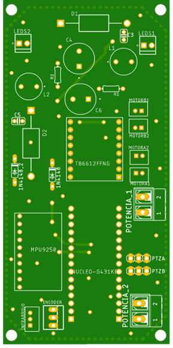
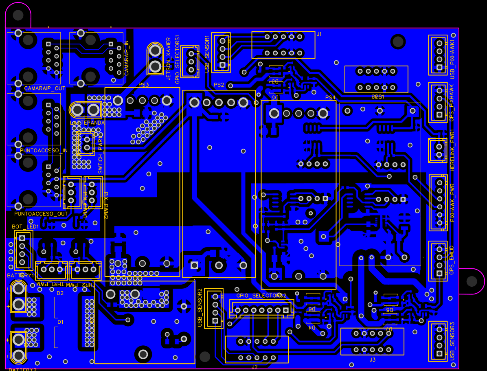
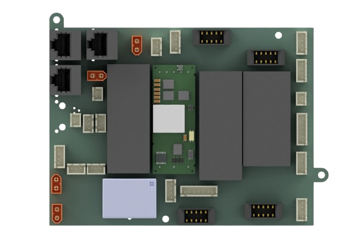
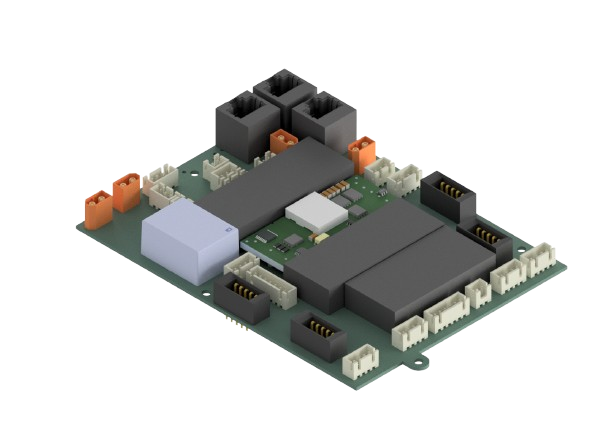
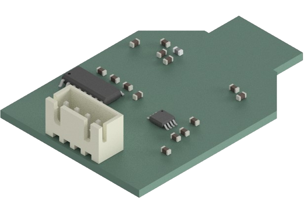
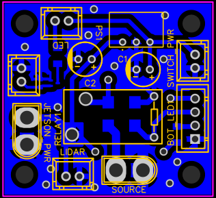

<h1 align="center">Hi 👋, I'm Daniela Carcausto</h1>
<h3 align="center">🤖 I am a Mechatronics Engineer from Peru passionate about electronics, embedded systems, and autonomous technologies. I have experience in PCB design, embedded programming, and 3D modeling, I’m motivated to grow in fields like artificial intelligence and robotics simulation.=

---

## 🌐 Socials:

 

---

## 💻 Programming Languages:

   

---

<h1>🛠️ PCB Experience </h1>

In this section, I showcase projects I've contributed primarily in electronics and PCB design. These designs were implemented and tested during my academic and professional experiences using tools such as **Eagle**, **EasyEDA**, and **KiCAD**.

### Projects:

- [Tank Barrel Inspection System](#tank-barrel-inspection-system)
- [Unmanned Surface Vehicle](#unmanned-surface-vehicle)
- [Swarm Robotics](#swarm-robotics)

## Tank Barrel Inspection System

**PCB Design and Electronics Integration:** Daniela Carcausto

This project involved the design and development of an inspection robot used for detecting structural failures inside tank barrels.

- **Microcontroller:** STM32431KB
- **Sensors:** Integrated IMU for position inside the tank barrel
- **Actuation:** Motor drivers for robot mobility
- **Illumination:** High-power LED drivers for internal lighting
- **Communication:** USB tethered connection with a laptop interface for real-time control and monitoring

  
  
  

  
  

  

## Unnamanned Superficial Vehicle

Design and development of four PCBs for an autonomous surface vehicle (USV) project. This project integrated multiple communication protocols including **Ethernet, RS232, RS485**, and **TTL**, allowing the system to interface with a variety of sensors. The four custom-designed PCBs were:

- **Main PCB**
- **Communication PCB**
- **Tumivision PCB**
- **Electric Winch PCB**

### 🔌 Main PCB

**PCB Design and Electronics Integration:** Jefferson Camargo, Daniela Carcausto  
The main PCB managed power distribution to all sensors, the onboard computer, the Tumivision module, and the electric winch. It also featured voltage selection capabilities to power different sensors according to their requirements. Moreover, with the GPIOs of the main computer and the communicaction PCB, different protocols depending on the sensor could be selected.  
**Features:**

- Power management for various modules
- Voltage selection for sensors
- Integrated **Ethernet switch** for communication with Tumivision, **PTZ camera**

  
  
  

  
  

  
  

### 📡 Communication PCB

**PCB Design and Electronics Integration:** Jefferson Camargo, Daniela Carcausto  
This compact board enabled switching between communication protocols such as **RS232, RS485**, and **TTL**. It connected to the main PCB and allowed the onboard computer to dynamically choose the desired protocol.

**Features:**

- Multi-protocol support
- Control interface with main computer
- Compact design for easy integration

  
  
  

  
  

  

### 🎥 Tumivision PCB

**PCB Design and Electronics Integration:** Daniela Carcausto  
This small board powered and connected the Tumivision module, which consisted of a **Jetson AGX Xavier**, a **Mid360 camera**, and a **stereoscopic camera**.

**Features:**

- Power supply for vision components, Ethernet switch, and indicator LED

  
  
  

  
  

  

### ⚙️ Electric Winch PCB

**PCB Design and Electronics Integration:** Daniela Carcausto  
Designed to control an electric winch module. It communicated via **RS485** with the main PCB to receive distance commands. An **encoder** is used for position feedback and included a **limit switch** to stop the winch when it returned to the initial position.

**Features:**

- RS485 communication
- Encoder integration for distance tracking
- Limit switch for safety stop

  
  
  

  
  
  

## Swarm robotics

**PCB Design and Electronics Integration:** Daniela Carcausto
